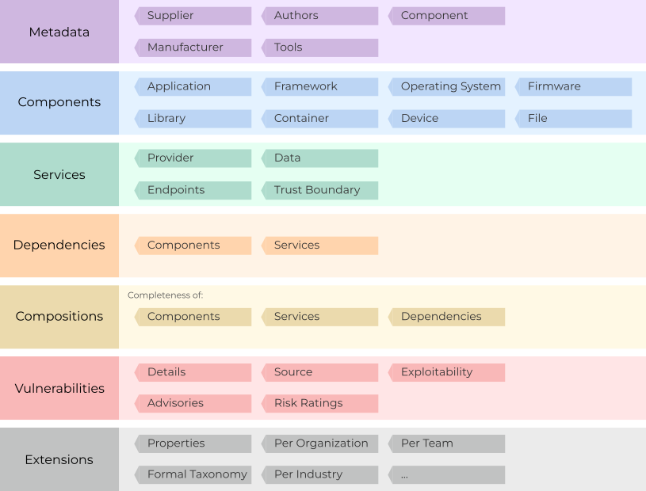

---
# Page settings
layout: document
keywords: application security, software security, software bill of material, SBOM, BOM, open source, supply chain, specification, spdx, license, package url, purl, cpe
comments: false
banner: false

# Hero section
title: Manufacturing Bill of Materials (MBOM)
window_title: CycloneDX - Manufacturing Bill of Materials (MBOM)
description: Manufacturing Bill of Materials (MBOM)

# Micro navigation
micro_nav: false

# Page navigation
    
---

# Manufacturing Bill of Materials (MBOM)

&nbsp;<!-- without this hack, the dropdown menu has issues due to h1 and h2 happening right after each other -->



CycloneDX supports many types of components, including hardware devices, making it ideal for use with consumer electronics,
<abbr data-title="Internet of Things">IoT</abbr>, <abbr data-title="Industrial Control System">ICS</abbr>, and other
types of embedded devices. CycloneDX fills an important role in-between traditional
<abbr data-title="Engineering Bill of Materials">eBOM</abbr> and <abbr data-title="Manufacturing Bill of Materials">mBOM</abbr>
use cases for hardware devices.
- Supports `device` as a first-class component type
- Utilizes a [formal and extensible taxonomy](https://github.com/CycloneDX/cyclonedx-property-taxonomy/blob/main/cdx/device.md) that defines a wide range of hardware devices and configurations

CycloneDX can represent any type of software component, service, and the firmware and hardware devices in an 'as-built'
product. A formal property taxonomy can be leveraged and extended to describe any type of hardware attribute or configuration.
CycloneDX can also reference documentation that may describe the 'recipe' for how the product is manufactured.  
Organizations, or entire industries, can also leverage multiple extension points to develop advanced models.

## High-Level Object Model

{: width="900"}

## Examples

BOMs demonstrating MBOM capabilities can be found at
[https://github.com/CycloneDX/sbom-examples](https://github.com/CycloneDX/sbom-examples)